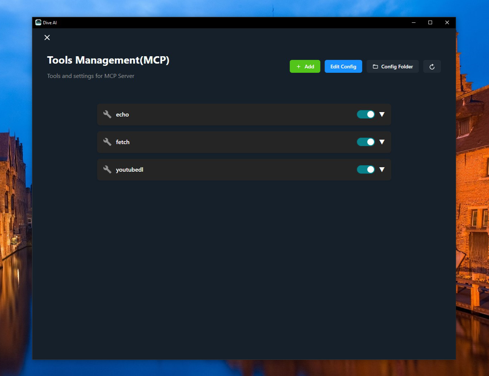

*This is a fork of the Dive AI client that can be configured by modifying `config/theme.config.json`*
*See `config/theme.config.example.json`*

# Dive AI Agent 🤿 🤖


[](https://discord.com/invite/qceMERf4y2)
[](https://twitter.com/Dive_ai_agent)

Dive is an open-source MCP Host Desktop Application that seamlessly integrates with any LLMs supporting function calling capabilities. ✨


## Features 🎯

- 🌐 **Universal LLM Support**: Compatible with ChatGPT, Anthropic, Ollama and OpenAI-compatible models
- 💻 **Cross-Platform**: Available for Windows, MacOS, and Linux
- 🔄 **Model Context Protocol**: Enabling seamless MCP AI agent integration on both stdio and SSE mode
- 🌍 **Multi-Language Support**: Traditional Chinese, Simplified Chinese, English, Spanish, Japanese with more coming soon
- ⚙️ **Advanced API Management**: Multiple API keys and model switching support
- 💡 **Custom Instructions**: Personalized system prompts for tailored AI behavior
- 🔄 **Auto-Update Mechanism**: Automatically checks for and installs the latest application updates

## Recent updates(2025/4/21)

- 🚀 **Dive MCP Host v0.8.0**: DiveHost rewritten in Python is now a separate project at [dive-mcp-host](https://github.com/OpenAgentPlatform/dive-mcp-host)
- ⚙️ **Enhanced LLM Settings**: Add, modify, delete LLM Provider API Keys and custom Model IDs
- 🔍 **Model Validation**: Validate or skip validation for models supporting Tool/Function calling
- 🔧 **Improved MCP Configuration**: Add, edit, and delete MCP tools directly from the UI
- 🌍 **Japanese Translation**: Added Japanese language support
- 🤖 **Extended Model Support**: Added Google Gemini and Mistral AI models integration

> **Important:** Due to DiveHost migration from TypeScript to Python in v0.8.0, configuration files and chat history records will not be automatically upgraded. If you need to access your old data after upgrading, you can still downgrade to a previous version.

## Download and Install ⬇️

Get the latest version of Dive:
[](https://github.com/OpenAgentPlatform/Dive/releases/latest)

For Windows users: 🪟
- Download the .exe version
- Python and Node.js environments are pre-installed

For MacOS users: 🍎
- Download the .dmg version
- You need to install Python and Node.js (with npx uvx) environments yourself
- Follow the installation prompts to complete setup

For Linux users: 🐧
- Download the .AppImage version
- You need to install Python and Node.js (with npx uvx) environments yourself
- For Ubuntu/Debian users:
  - You may need to add `--no-sandbox` parameter
  - Or modify system settings to allow sandbox
  - Run `chmod +x` to make the AppImage executable

## MCP Tips

While the system comes with a default echo MCP Server, your LLM can access more powerful tools through MCP. Here's how to get started with two beginner-friendly tools: Fetch and Youtube-dl.




### Quick Setup

Add this JSON configuration to your Dive MCP settings to enable both tools:

```json
 "mcpServers":{
    "fetch": {
      "command": "uvx",
      "args": [
        "mcp-server-fetch",
        "--ignore-robots-txt"
      ],
      "enabled": true
    },
    "filesystem": {
      "command": "npx",
      "args": [
        "-y",
        "@modelcontextprotocol/server-filesystem",
        "/path/to/allowed/files"
      ],
      "enabled": true
    },
    "youtubedl": {
      "command": "npx",
      "args": [
        "@kevinwatt/yt-dlp-mcp"
      ],
      "enabled": true
    }
  }
```

### Using SSE Server for MCP

You can also connect to an external MCP server via SSE (Server-Sent Events). Add this configuration to your Dive MCP settings:

```json
{
  "mcpServers": {
    "MCP_SERVER_NAME": {
      "enabled": true,
      "transport": "sse",
      "url": "YOUR_SSE_SERVER_URL"
    }
  }
}
```

### Additional Setup for yt-dlp-mcp

yt-dlp-mcp requires the yt-dlp package. Install it based on your operating system:

#### Windows
```bash
winget install yt-dlp
```

#### MacOS
```bash
brew install yt-dlp
```

#### Linux
```bash
pip install yt-dlp
```

## Build 🛠️

See [BUILD.md](BUILD.md) for more details.

## Connect With Us 🌐
- 💬 Join our [Discord](https://discord.com/invite/qceMERf4y2)
- 🐦 Follow us on [Twitter/X](https://x.com/Dive_ai_agent) [Reddit](https://www.reddit.com/user/BigGo_official/) [Thread](https://www.threads.net/@dive_mcpserver)
- ⭐ Star us on GitHub
- 🐛 Report issues on our [Issue Tracker](https://github.com/OpenAgentPlatform/Dive/issues)


